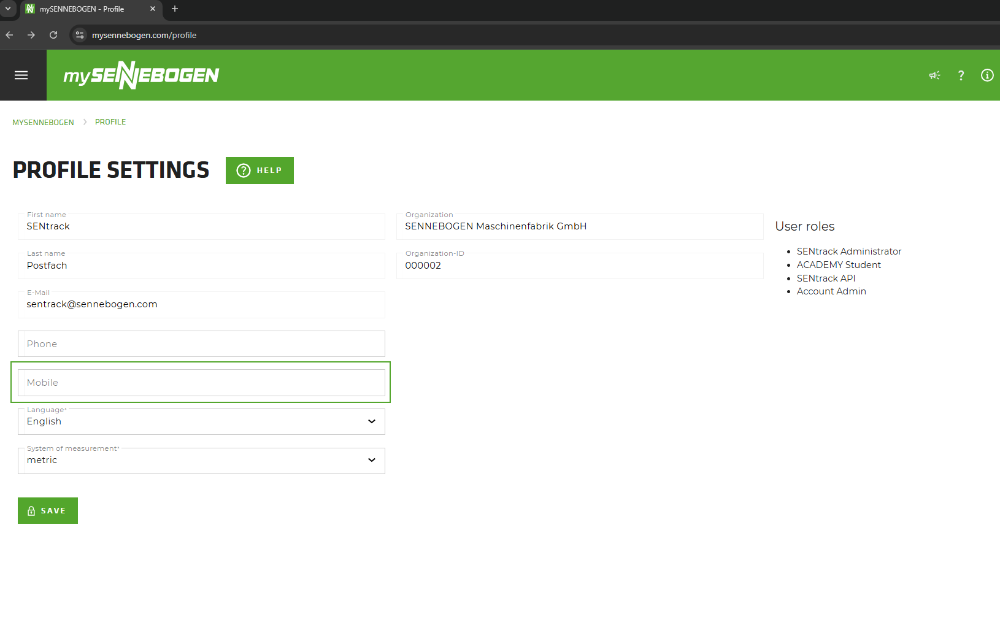
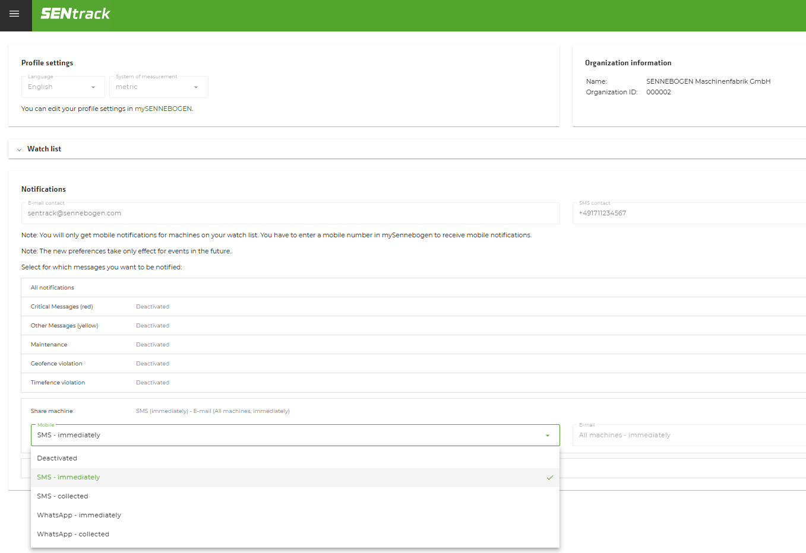

```{r setup, include=FALSE}
knitr::opts_chunk$set(echo = TRUE)
```

```{css echo=FALSE}
.bordered{
  border-style: solid;
}
```

## mySennebogen Profile

This is where users can enter their mobile numbers.
<div class="bordered">

</div>

## SENtrack Profile

This is where users can specify the type and frequency of messages they want to receive.
<div class="bordered">

</div>

<br/>
<br/>

## Privacy Policy
<embed src="SENNEBOGEN_LLC-Privacy_Policy_SMS.pdf" width="1000" height="750" type="application/pdf">

<br/>
<br/>

## Terms of Use
<embed src="SENNEBOGEN_LLC-Terms_of_Use.pdf" width="1000" height="750" type="application/pdf">
